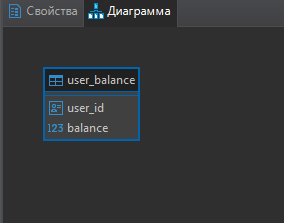

# Description

Rest API по работе с банковским счетом

## Started

```bash
mvn spring-boot:run
```

### Get Balance
```json
GET http://localhost:8080/getBalance?userId=:id
Response:
```json
{
    "result": "999.99",
    "message": "Ok"
}
```
Error:
```json
{
    "result": "-1",
    "message": "Incorrect result size: expected 1, actual 0"
}
```
### Take Money
```json
POST http://localhost:8080/takeMoney
Request:
{
    "userId": "d4223a5f-2b00-4e24-99e3-9d950b9f536c",
    "amount": "101.01"
}

Response:
{
    "result": "1",
    "message": "Ok"
}
Error:
{
    "result": "0",
    "message": "Сумма перевода больше баланса"
}
```
### Put Money
```json
POST http://localhost:8080/putMoney
Request:
{
    "userId": "d4223a5f-2b00-4e24-99e3-9d950b9f536c",
    "amount": "101.01"
}
Response:
{
    "result": "1",
    "message": "Ok"
}
Error:
{
    "result": "0",
    "message": "Incorrect result size: expected 1, actual 0"
}
```
## Структура базы данных

