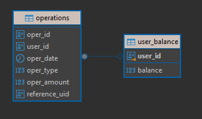

# Description

Rest API по работе с банковским счетом

## Started

```bash
mvn spring-boot:run
```

### Get Balance
```json
GET http://localhost:8080/getBalance?userId=:id
Response:
```json
{
    "result": "99999",
    "message": "Ok"
}
```
Error:
```json
{
    "result": "-1",
    "message": "Incorrect result size: expected 1, actual 0"
}
```
### Take Money
```json
POST http://localhost:8080/takeMoney
Request:
{
    "userId": "d4223a5f-2b00-4e24-99e3-9d950b9f536c",
    "amount": "10101"
}

Response:
{
    "result": "1",
    "message": "Ok"
}
Error:
{
    "result": "0",
    "message": "Сумма перевода больше баланса"
}
```
### Put Money
```json
POST http://localhost:8080/putMoney
Request:
{
    "userId": "d4223a5f-2b00-4e24-99e3-9d950b9f536c",
    "amount": "10101"
}
Response:
{
    "result": "1",
    "message": "Ok"
}
Error:
{
    "result": "0",
    "message": "Incorrect result size: expected 1, actual 0"
}
```
### Transfer Money
```json
POST http://localhost:8080/transferMoney
Request:
{
    "currentUserId": "38fabb96-0fc0-4ce8-b2bb-c6c90e957063",
    "destinationUserId": "358b7b44-7671-41fc-9679-20f4650d51ce",
    "amount": "1011"
}

Response:
{
    "result": "1",
    "message": "Ok"
}

Error:
{
    "result": "0",
    "message": "Incorrect result size: expected 1, actual 0"
}
```
### Operations list
```json
GET http://localhost:8080/getOperationList?userId=38fabb96-0fc0-4ce8-b2bb-c6c90e957063&fromDate=2025-03-12T00:00:00&tillDate=2025-03-13T00:00:00

Response:
[
    {
        "operationDate": "2025-03-12T23:05:48.198743",
        "operationType": "Снятие со счета",
        "operationAmount": 1000
    },
    {
        "operationDate": "2025-03-12T23:09:11.640129",
        "operationType": "Снятие со счета",
        "operationAmount": 1000
    },
    {
        "operationDate": "2025-03-12T23:09:41.413256",
        "operationType": "Снятие со счета",
        "operationAmount": 1001
    }
]
```
## Структура базы данных

